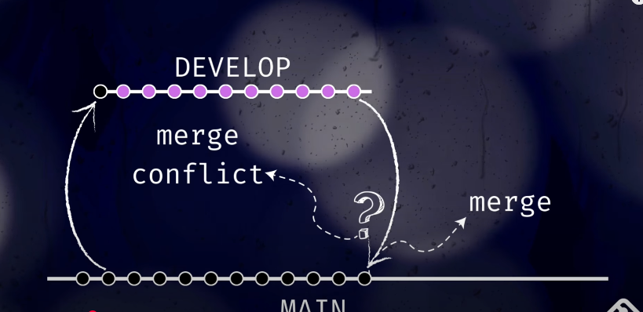

#  Урок 1. Git

[video-lesson-link](https://www.youtube.com/watch?v=nZriVFWoTec&ab_channel=your_java_mentor)

## Логіка роботи з гілками



---

## Commit

`git commit` — фіксує зміни в локальному репозиторії. Це як "зберегти" поточний стан проєкту. Коміт супроводжується повідомленням, яке пояснює суть змін.

---

## Merge

`git merge` — об'єднує одну гілку з іншою. Часто використовується для злиття змін з feature-гілки в основну (наприклад, `main` або `develop`).

---

## Feature-гілки

Feature-гілка — це окрема гілка в Git, яку створюють для роботи над новою функцією або зміною. 

Вона потрібна, щоб розробляти нові можливості, не змінюючи одразу основний код. Коли робота над фічею завершена, її зміни об'єднують з основною гілкою (наприклад, `main` або `develop`).


### Як це працює:

1. Від основної гілки створюють feature-гілку:
   ```bash
   git checkout -b feature/назва-фічі

---

## Pull

`git pull` — завантажує останні зміни з віддаленого репозиторію та одразу зливає їх у поточну гілку. Еквівалент `git fetch` + `git merge`.

---

## Merge conflict

Merge conflict виникає, коли Git не може автоматично об'єднати зміни з різних гілок. Потрібно вручну вирішити конфлікти у файлах перед завершенням злиття.


## Основні відмінності

| Характеристика         | `git pull`                         | `git merge`                      |
|------------------------|------------------------------------|----------------------------------|
| Джерело змін           | Віддалений репозиторій (`origin`) | Локальна гілка                   |
| Складається з          | `fetch` + `merge`                 | Тільки `merge`                   |
| Часте використання     | Синхронізація з сервером          | Об'єднання локальних змін        |


